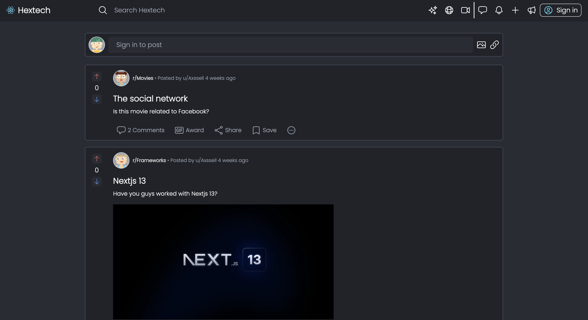
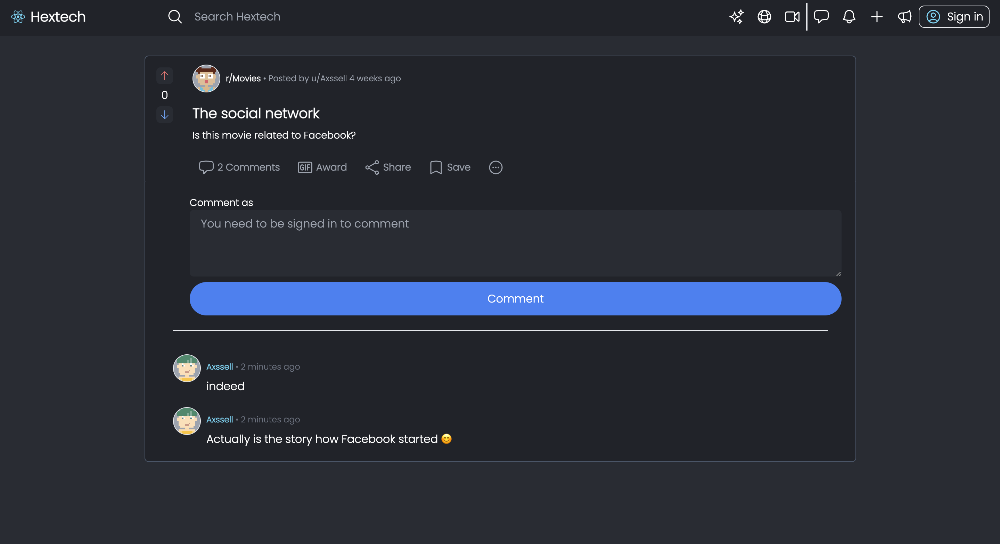
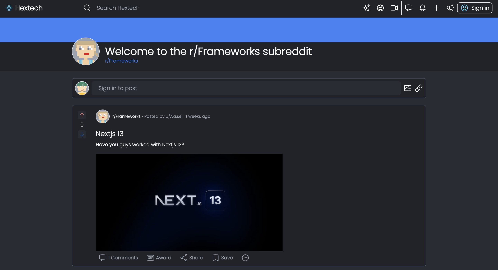
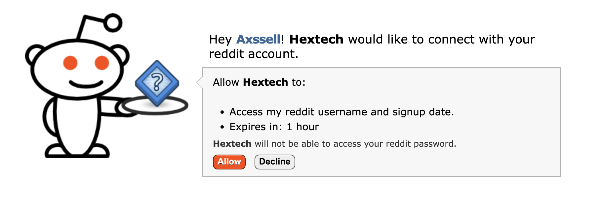

## Hextech 

This is a web application similar to Reddit where users can create, view, and interact with posts and communities. The app allows users to post anything, including images, and comment on existing posts. Additionally, users can create their own communities, called subreddits, where they can post and share content related to a specific topic or interest. The app also includes a sign in / log in system, although this feature is currently not available in the deployed production app to prevent spam due to limited database storage.

## Features

### Feed: 
The app's main feed displays all posts from all subreddits that a user is subscribed to. Users can view posts, upvote or downvote them, and comment on them.

### Post: 
Posts can be created by any user and can include text and/or images. Users can also view and comment on existing posts.

### Subreddit: 
Users can create their own subreddits, which are communities where they can post and share content related to a specific topic or interest.

### Log in / Sign in with Reddit account:
While the functionality to log in and sign up with a Reddit account is present, it is currently not available in the deployed production app due to limited database storage.

## Technologies Used
### Next.js: A popular React framework for building server-side rendered web applications.
### TypeScript: A superset of JavaScript that adds static type checking to the language.
### SQL: A standard language used to interact with relational databases.
### GraphQL: A query language used to interact with APIs and fetch data from servers.
### Tailwind CSS: A utility-first CSS framework for building custom user interfaces.

## Contributing
If you would like to contribute to this app, please create a pull request.
